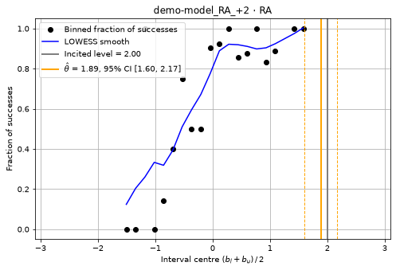
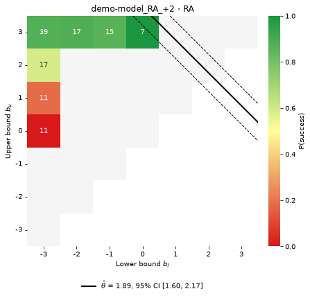
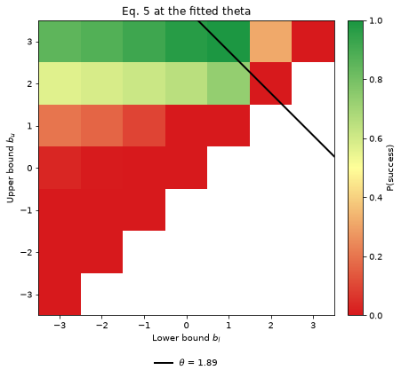
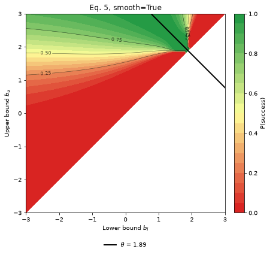
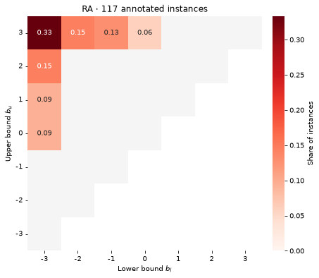
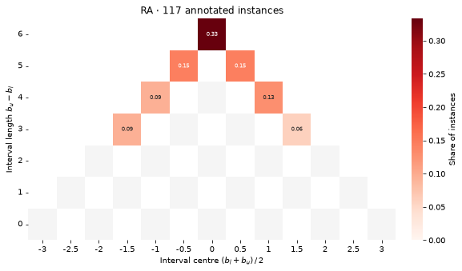
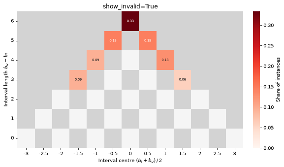

# Plots

Every figure needs the `plot` extra. Importing PROPEL never does: matplotlib and seaborn load
only when something is drawn.

| Figure | Data | Drawn by | Shows |
|---|---|---|---|
| [Propensity curve](#propensity-curve) | `build_empirical_curve` | `plot_propensity_curve` | one subject's success by interval centre |
| [Propensity surface](#propensity-surface) | `build_empirical_surface` | `plot_propensity_surface` | one subject's success by `(b_l, b_u)` |
| [Model surface](#model-surface) | `build_model_surface` | `plot_model_surface` | the success the model predicts for a `theta` |
| [Interval distribution](#interval-distribution) | `build_interval_distribution` | `plot_interval_distribution` | how a bank's intervals spread by `(b_l, b_u)` |
| [Interval tree](#interval-tree) | `build_interval_tree` | `plot_interval_tree`, `plot_interval_trees` | the same by centre and length |

Files in one go:

| Function | Writes |
|---|---|
| `save_profile_plots(profiles, annotations, outcomes, out_dir)` | a curve and a surface per (subject, dimension) |
| `save_annotation_plots(annotations, out_dir)` | a distribution and a tree per dimension, plus a grid of trees |
| `propel-fit ... --plots DIR` | both of the above |

Signatures and every parameter: [API: plotting](api/plotting.md).

## Conventions

- **Axes.** `b_l` (or the interval centre) runs across; `b_u` (or the interval length) runs
  up.
- **Three cell states on every grid:**
  - *occupied*: coloured by value, and labelled;
  - *valid but empty*: whitesmoke;
  - *impossible*: blank, or light grey in trees with `show_invalid=True`.
- **Success colours** go red (0) → yellow → green (1) on every surface, empirical or modelled.
- **Estimate lines.** A solid line marks `b_l + b_u = 2·theta`, the intervals centred on the
  estimate. Dashed lines mark its 95% bounds. Legends sit below the axes, never over data.
- **A fit that did not converge** says so beside its estimate.
- **Where figures go.**
  - Every `plot_*` function draws onto the `ax` you pass, or onto a new pyplot figure.
  - Nothing calls `plt.show()`.
  - The `save_*` functions render off-screen, and need no display.

## Propensity curve



- **Black dots:** the fraction of successes among instances whose interval centre
  `(b_l + b_u)/2` falls in each bin.
- **Blue line:** a LOWESS smooth of the dots. It should peak near `theta`.
- **Orange lines:** `theta` (solid) and its 95% interval (dashed).
- **Grey line:** the incited level, when you pass `incited=`.

Integer intervals stack their centres into a few columns. Build the curve with `jitter=0.25`
for display: the jitter moves only the plotted points, never the fitted data.

```python
from propensity import build_empirical_curve, plot_propensity_curve

curve = build_empirical_curve(demands, success, n_bins=20, lowess_frac=0.4, jitter=0.25, seed=0)
ax = plot_propensity_curve(curve, theta=1.89, ci95=(1.60, 2.17), incited=2, title="subject · RA")
```

## Propensity surface



- **Cells:** each `(b_l, b_u)` pair observed for this subject, coloured by its success rate and
  labelled with its count.
- **Pale grey cells:** valid intervals with no instances.
- **Blank triangle:** impossible intervals (`b_l > b_u`).
- **Lines:** `b_l + b_u = 2·theta` and its bounds.

Read it for coverage:
- **Informative cells sit near the line and are narrow** (close to the diagonal `b_l = b_u`).
- **Cells far from the line, or crowded into `[-3, +3]`** (top-left corner), cannot locate
  `theta`, however many there are.

In the example, every observed interval touches `-3` or `+3`, so the fit rests on a few cells.

```python
from propensity import build_empirical_surface, plot_propensity_surface

surface = build_empirical_surface(demands, success)          # bounds must be integers in [-3, 3]
ax = plot_propensity_surface(surface, theta=1.89, ci95=(1.60, 2.17), converged=True)
```

An estimate beyond `±3.5` draws no line, but still appears in the legend.

## Model surface

 

The success probability the response model predicts at a given `theta`, for every interval: what
the empirical surface would converge to with unlimited data.

- **`smooth=False`** (default, left) uses the empirical surface's integer grid, so the two can
  be compared cell for cell.
- **`smooth=True`** (right) is continuous, drawn as filled contours with labelled lines at
  0.25, 0.5 and 0.75.

```python
from propensity import build_model_surface, plot_model_surface

plot_model_surface(build_model_surface(1.89))                              # cells
plot_model_surface(build_model_surface(1.89, smooth=True, resolution=0.05))  # contours
```

It is built with `two_sided_sigma`, so `k`, `min_width` and `rho` mean exactly what they mean in
the fit.

## Interval distribution



How one dimension's annotated intervals spread over the bounds grid, before any model is
involved:
- each occupied cell shows its share of the bank (or its count, with `proportion=False`);
- a share too small to print shows as `<.01`, never as `0.00`.

It shows whether the bank can locate `theta` anywhere on the scale, or only in part of it.

```python
from propensity import build_interval_distribution, plot_interval_distribution

plot_interval_distribution(build_interval_distribution(demands), proportion=True, cmap="Reds")
```

## Interval tree

 

The same intervals by centre (across) and length (up), the "Christmas tree":

- **The base** holds the zero-length intervals `[v, v]`.
- **The tip** is `[-3, +3]`, the orthogonal interval. A bank crowded at the tip carries little
  information.
- **The blank checkerboard.** An even length needs a whole-numbered centre, and an odd length a
  half-numbered one, so half the cells inside the outline cannot be occupied, and are blank.
  `show_invalid=True` (right) fills them, and the cells outside the tree, in light grey.

```python
from propensity import build_interval_tree, plot_interval_tree, plot_interval_trees

plot_interval_tree(build_interval_tree(demands), show_invalid=False)

# several banks on one colour scale, with one colour bar
figure = plot_interval_trees({"RA": build_interval_tree(ra), "Ex": build_interval_tree(ex)},
                             title="Annotated intervals", show_invalid=True)
```

`plot_interval_trees` lays panels out with the fewest empty slots, then the squarest grid. Pass
`nrows` or `ncols` to choose.

## Figures in files

```python
from propensity import save_annotation_plots, save_profile_plots

save_profile_plots(profiles, annotations, outcomes, "plots/")        # after fit_profiles
save_annotation_plots(annotations, "plots/", show_invalid=True)      # dimensions: all by default
```

- **Filenames** are `{subject}_{dimension}_curve.png`, `…_surface.png`,
  `{dimension}_intervals.png`, `{dimension}_tree.png` and `interval_trees.png`, made safe for
  every filesystem. Names that would collide get a numeric suffix.
- **Failures are isolated.** A figure that fails, for example a surface over non-integer
  bounds, is logged and skipped, and the rest are written.
- **The return value** is the list of paths written.

## Composing figures

Every `plot_*` function takes `ax`, so figures combine freely:

```python
import matplotlib.pyplot as plt

fig, (left, right) = plt.subplots(1, 2, figsize=(13, 5.5), layout="constrained")
plot_propensity_surface(build_empirical_surface(demands, success), theta=1.89, ax=left)
plot_model_surface(build_model_surface(1.89), ax=right)
fig.savefig("compare.png", dpi=150, bbox_inches="tight")
```
